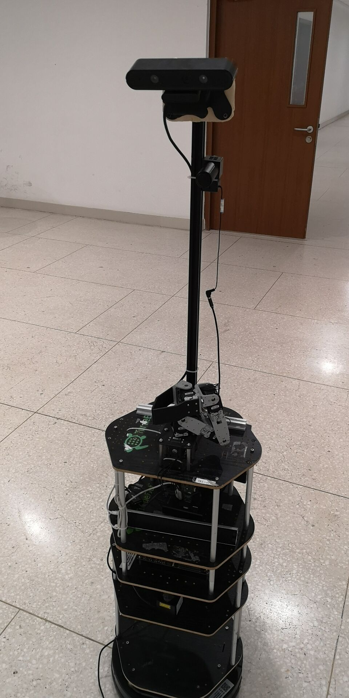
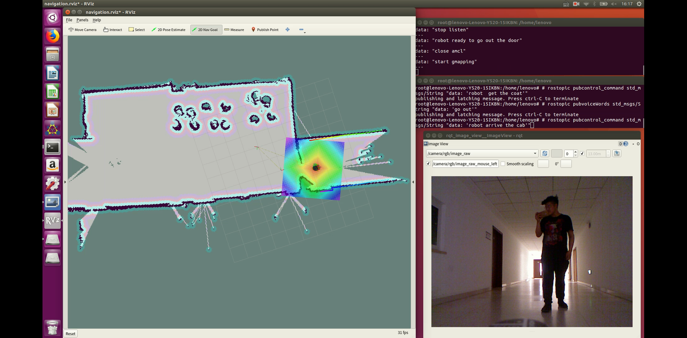
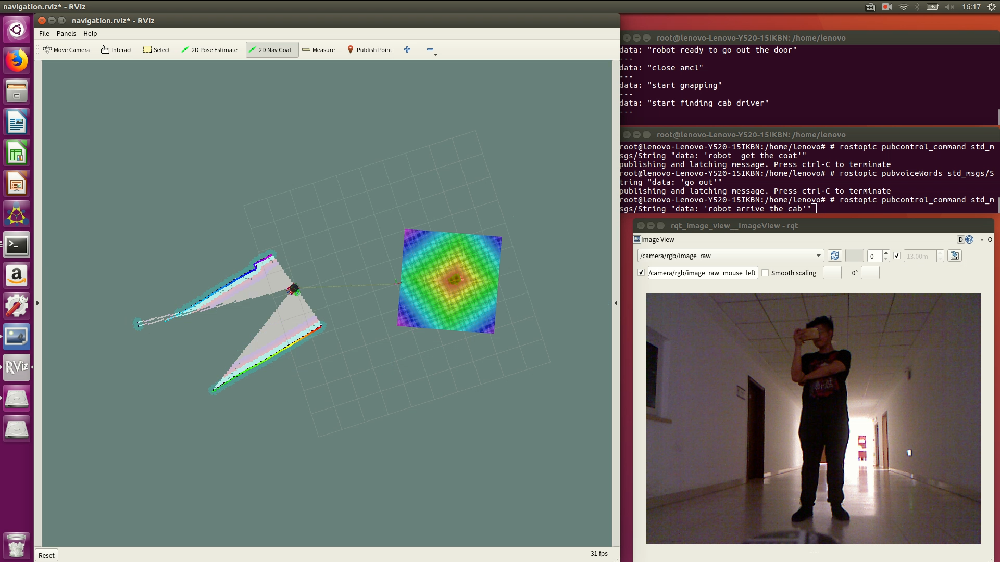

# $Abstract$

​	Based on the task of ($ROBOCUP2019 - Stage1\ Farewell$), this article mainly introduces how to implement a service robot that can complete the task of picking up and dropping guests.We will introduce the overall framework of our design, the robot function platform we designed, our contribution to the software development of service robots, and the contribution of our development to related technologies and sciences.Among them, we mainly implement the loop state control system based on finite state machine, the scheme of establishing map based on SLAM and optimized EKF algorithm, the blind navigation system based on visual control and the speech recognition system based on $Keda\ Xunfei $ API.In the navigation aspect, we also designed a solution for automatic real-time pose output, known area navigation and blind navigation smooth switching. In terms of speech, we designed a speech recognition intelligent control system to realize automatic opening and closing of speech recognition. And try to improve the accuracy of speech recognition through voice filtering and other operations.Finally, we summarize our research and propose directions for improvement and further research.

​	$Keywords:\ EKF-SLAM\ Algorithm ;Speech\ Recognition ; Blind \ Navigation; Closed\ Loop\ Finite\ State\ Machine $ 

# $Introduction$

​	Our group mainly chooses to complete the $Farewell$ task, and now we will further explain what we have done and what we expected to realize.

​	The background of the task is as follows:

​	Some guests are tired, so they call the robot to retrieve their coat. It's raining outside and there
is only one umbrella, so the robot takes the guests one by one to their cab and returns with the
umbrella.

​	The main goal of the task are as follows:

​	The robot escorts two tired guests to their cab (where the cab driver is standing).

​	In order to achieve this task, we break down the task into four subtasks, and finally we further decompose the task. Finally, all tasks are divided into the following stages:

1. Waiting to start and identify the customer stage
2. Picking stage and passing item stage
3. Accompanying customers to go out and find drivers
4. Recycling umbrella and navigation regression stage

Then we further split the task process, and the corresponding main technologies are given by the following stages:

$Stage\quad 1$: Visual recognition and voice communication.

$Stage\quad 2$: Autonomous navigation, robotic arm grabbing, visual recognition.

$Stage\quad 3$: Autonomous navigation, blind navigation, robotic man-machine combination, visual recognition, speech recognition.

$Stage\quad 4$: Robotic arm grabbing, autonomous navigation, speech recognition.

​	In the end, we combined the various innovative algorithms with hardware framework design and software control system design to finally complete the corresponding tasks on $turtlebot2$. Below we will introduce our research and innovation in accomplishing the above tasks in the order of hardware design, software contribution and scientific and technological contributions.

# $Framework$

## $Robot\ system\ design\  framework$

<div align=center>
    	
</div>
​																				$Robot\ system\ design\  framework$

​	The picture above is the overall framework of our robot system design.


## $Task\ implementation\ process$


​																			$Task\ implementation\ process$

From the above figure, we can see that we can complete the whole task mainly into the following stages:

1. First navigate to the initial point and wait for the voice to wake up (voice)
2. After the voice wakes up, it starts to recognize people (visual)
3. The location where you start to grab the object after identifying the person (navigation)
4. Start grabbing the object (mechanical arm) after reaching the location where the object is grabbed
5. Ready to navigate back to the original call point after the crawl is complete (navigation)
6. After reaching the call point, give clothes and an umbrella to wait for the voice to wake up and prepare to go out (voice & & mechanical arm | | manual assist)
7. After waking up, go out and reach the door identification point (navigation)
8. Start recognition at the door recognition point (visual)
9. After reaching the driver's location, arrive at the driver and turn on the voice recycling umbrella to wait for the return signal (speech && robotic arm || manual assist)
10. After receiving the return signal, prepare to return to the initial servo point for a new round of servo (navigation)

# $Robot\ hardware\ platform$

## $distance\ sensor$

​	In order to make the map more accurate and navigation more accurate, we chose to use Lidar navigation for navigation and mapping. Through the design we added the following laser radar driver, and finally completed the map-building related process with $gmapping$ algorithm. Its main structure is as follows:

<div align=center>
		    
</div>
​																			$distance\ sensor$

## $Vision\ sensor$

​	Since the task requires us to identify people's information through visual algorithms, we use $astra$ as our vision sensor.

​	Its main structure is shown below:

<div align=center>
		    
</div>


​																						$Vision\ sensor$

## $Robot\ structure$

The robot model we designed is as follows:

<div align=center>
		    
</div>


​	

​																			Robot hardware platform

# $Robot\ Software\  Contribution$


## $Navigation\ and\ SLAM$

### $SLAM\ Algorithm\ Optimization$

​	When we initially tried to use the system's original $gmapping$  
 navigation, we found that the mapping effect was not good, and it had a great influence on the subsequent navigation. So we proposed navigation based on Kalman filtering algorithm. Below we give a comparison of the principle analysis and the actual operation results.

#### $Principle\ Analysis\ of\ EKF\_SLAM\ Algorithm$

##### $EKF\ Principle$

​	The self-positioning process of mobile robots is a nonlinear process. From a statistical point of view, the SLAM problem is a filtering problem. EKF can remove the noise in the system well when the system noise and measurement noise obey the normal distribution. The interference also achieves the best estimate, so Smith and Cheeseman proposed the EKF-SLAM algorithm using EKF to estimate the SLAM problem. The block diagram of the algorithm is shown below.


<div align=center>
		  
</div>


​                                                                $EKF - SLAM\ Algorithm\ Process$

​	The extended Kalman filter algorithm is a commonly used nonlinear filtering method. The principle is to perform Taylor expansion on the system state equation and measurement equation at the prediction point $x_{k|k-1}$, and ignore all nonlinear expansion high order. The term thus achieves a linearized approximation of the nonlinear equation. The commonly used nonlinear discrete stochastic system models are as follows:
$$
\begin{array}{l}{x_{k+1}=f\left(x_{k}, u_{k}\right)+w(t)} \\ {z_{k}=h\left(x_{k}\right)+v(t)}\end{array}
$$
​	Where $w, v $ represents the $0-Mean\ Gaussian\ Noise$ added during the operation of the nonlinear system. Linearizing the system equation is expressed as:
$$
\begin{array}{l}{x_{k} \approx \hat{x}_{k}+J\left(x_{k-1}-\hat{x}_{k-1}\right)+W \omega_{k-1}} \\ {z_{k} \approx \hat{z}_{k}+H\left(x_{k}-\hat{x}_{k}\right)+V v_{k}}\end{array}
$$
In the above formula $J=J(k)=\left.\frac{\partial f}{\partial x}\right|_{\left(x_{k}, u_{k}\right)}, H=H(k)=\left.\frac{\partial h}{\partial x}\right|_{x=x_{k}},W=W(k)=\left.\frac{\partial f}{\partial \omega}\right|_{\left(x_{k}, u_{k}\right)}, V=V(k)=\left.\frac{\partial h}{\partial v}\right|_{x=x_{k}}, \hat{z}_{k}$

represents an observation, and $\hat{x}_{k}$ represents the predicted value. The initial time filter is set to:
$$
\hat{x}_{0}=E\left(x_{0}\right), P_{0}=E \quad\left[x_{0}-\hat{x}_{0}\right)\left(x_{0}-\hat{x}_{0}\right)^{\mathrm{T}} ]
$$
The prediction update can be performed by the first three sub-iterative operations below, and the status update can be performed by the following four sub-iterative operations.
$$
\begin{array}{l}{x_{k+1 | k}=f\left(x_{k | k}, u_{k}\right)} \\ {P_{k+1 | k}=J P_{k | k} J^{\mathrm{T}}+Q_{k}} \\ {S_{k+1}=H_{k+1} P_{k+1 | k} H_{k+1}^{\mathrm{T}}+R_{k+1}} \\ {W_{k+1}=P_{k+1 | k} H_{k+1}^{\mathrm{T}} S_{k+1}^{-1}} \\ {\vartheta_{k+1}=z_{k+1}-h\left(x_{k+1 | k}\right)} \\ {x_{k+1 | k+1}=P_{k+1 | k}-W_{k+1} S_{k+1}} \\ {P_{k+1 | k+1}=P_{k+1 | k}-W_{k+1} S_{k+1} W_{k+1}^{\mathrm{T}}}\end{array}
$$

##### $EKF-SLAM\ Algorithm$

​	The EKF-based SLAM algorithm includes two processes: motion update and observation update, which are descriptions of the system's motion model and observation model, respectively. The motion update process uses each sensor data as an input control amount to predict and estimate the current position of the robot. The observation update is a process in which the mobile robot observes the feature points in the current environment and matches the partial map while updating the position of the robot in the map. Usually the robot SLAM stores the pose information $x_v$, and the map feature $m_i(x_i, y_i)$ in a separate state vector $x_{ml}$:
$$
x_{m l}(k)=\left[ \begin{array}{c}{x_{v}(k)} \\ {m^{i}(k)}\end{array}\right]
$$
​	Where $x_v(k)$ represents the pose of the mobile robot at time k, and $m_n^i(k)$ represents the set of n map point features at time k. The covariance matrix between the features and poses of the system is:
$$
P_{m l}(k)=\left[ \begin{array}{cc}{p_{t v}(k)} & {p_{r m}(k)} \\ {p_{m v}(k)} & {p_{m m}(k)}\end{array}\right]
$$
​	The entire map information is $M^{B}=\left(x_{m l}, P_{m l}\right)$

​	In the prediction of the state of the robot by the EKF algorithm (4), the prediction of the feature position of the map is included: $\hat{z}$, and the mobile robot performs data association matching through the observation value of the external sensor $z$, and the mobile robot passes the $ The matching information of z$ and $\hat{z}$ is self-positioned and the map is updated.

​	Finally, we combined the $gmapping$ algorithm to achieve the complete construction of the map.

##### $Algorithm\ Utility\ Analysis$

​	Below is a map that we built directly with the $gmapping$ algorithm without adding $EKF\ Filtering$.

<div align=center>
		  
</div>
​																		Map created without EKF filtering

​	It can be seen that the mapping effect is poor. The following is the effect of the mapping in the same environment that we implemented with$ EKF\ Filtering $:

<div align=center>
		  
</div>
​																	Map created with EKF filtering

​	From the above figure, we can see that the SLAM construction effect after adding the EKF algorithm has been significantly improved, and the finally established image can be closed.

### $Navigation$

#### $Automated\ Real-Time\ Pose\ Output$

​	In our design process, the pose latching technique is used many times, that is, the pose of a certain moment is saved to restore the original pose state in the same global coordinate system in the future, thereby achieving full state restoration. The specific implementation can be seen in Appendix II:

​	The main purpose is to use the conversion data of the map 	coordinate system and the base_link coordinate system, and transmit the corresponding coordinate system to transform the data, thereby obtaining the real-time pose information of the robot at any time.

#### $Automated\ Positioner$

​	Based on the pose and latching, we hope that $rviz's$ pose positioning function can be realized without human operation, so that we can automatically perform $rviz$ pose correction in the case of determining the pose of the robot.

​	The message diagram of its  is as follows:

<div align=center>
		  
</div>
​																	AMCL node message flow diagram

​	Mainly by releasing the topic information named `"initialpose"`, the pose state of the robot is restored by the originally locked pose information, and finally the success rate of the $AMCL$ navigation and positioning can be improved.

#### $Blind\ Navigation\ Technology$

​	The initial $gmapping$ combined with the $move\_base$ navigation cannot reach the unknown area, that is, the area without the map cannot navigate autonomously.

​	So by modifying the parameter interface of $move\_base$ and combining the coordinate input of visual recognition, we finally realized the navigation function in the case where the map is unknown.

#### $Map\ Navigation\ and\ No-Map\ Navigation\ Switching\ Technology$

##### $Move\_base\ Navigation\ Frame$

​	The main framework of $move\_base$ is as follows:

<div align=center>
		  
</div>
​																			$move\_base$ Basic Framework

​	In the navigation of $ros$, we generally use the keyboard control to combine $gmapping$ for $SLAM$ and build the map, use $map\_server$ to store the map we just created, and then open $AMCL$ with the map that has been built. Further navigation. We hope to update the map in real time while navigating, and keep the original map intact, which is convenient for secondary use. However, if we open $gmapping$ directly, the updated map will empty the original map, which will not be able to maintain the original map. So we designed a map navigation using $AMCL$ and $map\_server$ and a no-map navigation using $gmapping$ and $move\_base$, and built a bridge between the two states to achieve map navigation. Smooth switching with and without map navigation can finally achieve the effect of the secondary servo required by $Farewell\ Task$.

##### $Map\ Navigation\ Node\ Message\ Map$

<div align=center>
    
</div>
​																$move\_base$ message frame diagram

​	From the above figure, we can see that we use the filtered laser information and provide a static map to design the entire contents of the map navigation.

##### $Dynamic\ State\ Switching\ Technology$

​	In order to achieve the following process:

<div align=center>
    
</div>
​																			Navigation state transition diagram

​	To complete the state switching, we have designed the dynamic state switching algorithm as follows:

​	First, we design an empty node to easily close the corresponding state and turn on another state.

So we can complete the closing of the $gmapping$ state.

​	Then by interacting directly with the system, dynamic state switching is achieved, so we can achieve complete unattended operation.

##### $ State\ of\ The\ RVIZ\ Before\ Switching$

<div align=center>
    
</div>
​																Operation diagram before state transition

​	As can be seen from the above figure, when $AMCL$ is turned on, we are navigating based on the map.

##### $RVIZ\ State\ After\ Switching$

<div align=center>
    
</div>
​															Operational diagram after state transition

​	After turning on $gmapping$, we implemented blind navigation for building maps in real time.


## 	$voice$

### $Keda\ Xunfei\ Speech\ Recognition\ API\ Optimization$ 

​	We mainly use the speech recognition system of $Keda\ Xunfei$. Among them, we complete the voice control through a series of processes such as voice reception, string filtering, command recognition and voice blocking.

​	Based on the $Keda\ Xunfei$ API, we designed the ROS interface to design the corresponding speech recognition and speech recognition wake-up operations. Its main implementation can be seen in Appendix III. The main node relationship diagram is as follows:

<div align=center>
    	
</div>
​																				Voice node control flow graph

And` /sound_node `can send the identified information to our core node.

### $Voice\ Blocking$

​	In order to reduce the computational pressure of the computer during voice control, improve the real-time performance of the robot system and avoid the interference of the wrong voice control and noise on the control system, we realized the automatic opening and closing of the voice recognition by adapting the $Keda\ Xunfei$ voice API. The relationship is as follows:

<div align=center>
    
</div>
​																			 $Keda\ Xunfei$ API Control Flow Chart

​	From the above figure, we can see that we turn on and off speech recognition through the `/open_voice` node control`/sound_node`(the modified node of the $Keda\ Xunfei$ voice API).

### $Speech\ Filtering$

​	Because the string format recognized by $Keda\ Xunfei$ is not standardized, it is difficult to process, and Chinese characters are often recognized, which tends to cause the node to close. Therefore, we have added a string filtering algorithm, mainly by designing keyword recognition technology and removing noise. To improve the accuracy of our speech recognition.

​	Through the relevant tests, our algorithm can recognize the corresponding control signals regardless of the voice recognition input of noise, noise and Chinese characters, so as to accurately initiate the control command.

# $Technology\ and\ Scientific\ Contributions$

### $Finite\ State\ Machine\ Control$

​	We mainly design a set of finite state machines that can be self-starting. The flow of the entire finite state machine is as follows:

<div align=center>
		    
</div>
​																	Loopback finite state machine design diagram


​	From the above figure we can see that we have adopted loopback control. At the beginning and end of the mission, the state of the robot is guaranteed to be consistent, including the consistent pose and the state of the algorithm. That is, before each task is executed, the robot is in the same state (that is, the state of the map navigation and voice servo is turned on).

​	The main code of its control part is in `set_goal.cpp`, the core code is shown in Appendix 1:

<div align=center>
		    
</div>

​																	Core node message flow diagram

​	As can be seen from the above figure, we mainly use the voice signal control combined with the state signal to control the two-way control to ensure that the voice node can be blocked at the moment when the voice is not needed, and the robustness of the control system is improved.

# $Summary\ and\ Outlook$

## $Summary$

​	We mainly complete the whole task of farewell by designing a complete closed-loop control system, which proposes multi-sensor fusion, blind navigation combined with deep learning visual positioning, and combined with $Keda\ Xunfei $ intelligent voice controller and voice response. For robot software development, we first adopted a dual-controlled algorithm execution framework and implemented a navigation-centric multi-interface multitasking execution system.

## $Outlook$

​	We hope to further optimize the path planning for blind navigation by combining the RRT algorithm.

# $References$

[1]Xu Yulong. Research on ROS-based mobile robot construction and navigation technology [D]. Harbin Institute of Technology, 2017.

[2]Zhu Jingquan. Research on interactive map construction and path planning technology for service robots [D]. Harbin Institute of Technology, 2017.

[3]Gu Qiyang. Design and implementation of ROS-based home service robot SLAM [D]. Northwest Normal University, 2016.

[4] Tian Liangliang. ROS-based exploration and environment modeling of unknown regions of mobile robots [D]. Northeastern University, 2015.

[5] Hu Chunxu, Xiong Wei, Ren Wei, He Dingxin. Positioning and Navigation of Indoor Mobile Robot Based on Embedded System[J]. Journal of Huazhong University of Science and Technology(Natural Science Edition), 2013, 41(S1): 254-257 +266.

# $Appendix$

## $Appendix\ I\quad set\_goal\ core\ code$

```cpp
void fare_well::cmd_cb(const std_msgs::String::ConstPtr &msg)
{
    cmd_str = msg->data.c_str();
    if( work_begin && is_equal(cmd_str,"robot finish recognize the people")||is_equal(cmd_str,"robot  finish first task"))
    {
        robot_go_to_the_shelf = true;
        
        order_command("stop listen");
        tell_the_task("plase wait a minute , and i will take back your coat!");
        ROS_INFO("plase wait a minute , and i will take back your coat! ");
        get_present_pos(this->last_pos);
        go_to_the_shelf();
        robot_go_to_the_shelf = false;
        cmd_str = "";
        return ;
    }
    if( work_begin && is_equal(cmd_str,"robot  get the coat")||is_equal(cmd_str,"robot finish second task"))
    {
        robot_go_back_to_the_call_place = true;

        order_command("stop listen");
        
        tell_the_task("ready to go back to the calling place!");
        ROS_INFO("ready to go back to the calling place!");
        go_to_place(this->last_pos);
        robot_go_back_to_the_call_place = false;
        tell_the_task("here is you coat");
        sleep(1);
        tell_the_task("are you ready to go out?");
        
        order_command("start listen");
        cmd_str = "";
        return ;
    }
    if( work_begin && is_equal(cmd_str,"robot ready to go to the door"))
    {
        robot_go_out_the_door = true;
        order_command("stop listen");
        
        tell_the_task("let's go out , i will take you to your cab");
        ROS_INFO("let's go out , i will take you to your cab ");
        go_to_the_door();
        out_door_pose.pose.pose = cur_pose;
        robot_go_out_the_door =false;
        cmd_str = "";
        order_command("close amcl");    
        sleep(3);                        
        order_command("start gmapping");
        sleep(3);
        return ;
    }
    if(work_begin && is_equal(cmd_str,"find the cab pose"))
    {
        robot_go_to_the_cab = true;
        get_present_pos(this->last_pos);
        tell_the_task("this way please!");
        ROS_INFO("this way please!");
        sleep(5);
        go_to_the_driver();
        order_command("robot arrive the cab");
        cmd_str = "";
        robot_go_to_the_cab =false;
    }
    if( work_begin && is_equal(cmd_str,"robot arrive the cab"))
    {
        
        tell_the_task("thank you for your coming!");
        ROS_INFO("thank you for your coming!");
        tell_the_task("can you give me the umbrella?");
        sleep(5);
        order_command("start listen");
        cmd_str = "";
    }
    if( work_begin && is_equal(cmd_str,"robot get the umbrella")||is_equal(cmd_str,"robot  finish last task"))
    {
        order_command("stop listen");
        robot_go_back_to_the_door = true;
        tell_the_task("get back the door!");
        ROS_INFO("get back the door!");
        go_to_place(this->last_pos);
        robot_go_back_to_the_door =false;
        order_command("close gmapping");
        sleep(5);
        order_command("start amcl");
        for(int i=1;i<=10;i++)
       { pub_est_pose.publish(out_door_pose);
         sleep(1);
       }
       order_command("go back to serve");
        cmd_str ="";
    }
    if (work_begin && is_equal(cmd_str, "go back to serve"))
    { 
        sleep(5);
        pub_est_pose.publish(out_door_pose);
         robot_go_back_to_the_serving_place = true;
        

        go_to_serve_place();
        order_command("start listen");
        robot_go_back_to_the_serving_place = false;
       
        work_begin = false;
        work_done = true;
       
        
        cmd_str = "";
        }

}
void fare_well::cb(const std_msgs::String::ConstPtr & msg )
    {
        
      std::string voice_command;
       
       voice_command = msg->data.c_str();
       cout<<voice_command<<endl;
  
       if(is_equal(voice_command,"i want to go")||is_equal(voice_command,"take me out"))
       {
           order_command("stop listen");
           tell_the_task("task confirmed!");
          
           tell_the_task("start recognizing");
           ROS_INFO("start recognizing");
           
           work_begin = true;
           work_done = false;
       }
      
       if(work_begin && is_equal(voice_command,"we can go out")||is_equal(voice_command,"go out"))
       {
           order_command("stop listen");
           order_command("robot ready to go to the door");
       }
       
       if(work_begin && is_equal(voice_command,"you can go back")||is_equal(voice_command,"go back"))
       {
           order_command("robot  finish last task");
       }

    }
```

## $Appendix\ II\ real-time\ pose\ output\ implementation\ source\ code$

```c++
void get_present_pos(geometry_msgs::Pose & pre_pos )
{
    tf2_ros::Buffer tfBuffer;
    tf2_ros::TransformListener tfListener(tfBuffer);
    int flag=0;
    while(ros::ok()&&flag==0)
    {
    geometry_msgs::TransformStamped transformStamped;
     try{
        transformStamped = tfBuffer.lookupTransform("map", "base_link",
                               ros::Time(0));
        pre_pos.position.x = transformStamped.transform.translation.x;
        pre_pos.position.y = transformStamped.transform.translation.y;
        pre_pos.position.z = transformStamped.transform.translation.z;
        pre_pos.orientation.x = transformStamped.transform.rotation.x;
        pre_pos.orientation.y = transformStamped.transform.rotation.y;
        pre_pos.orientation.z = transformStamped.transform.rotation.z;
        pre_pos.orientation.w = transformStamped.transform.rotation.w;
        flag=1;
        }
    catch (tf2::TransformException &ex) {
      ROS_WARN("%s",ex.what());
      ros::Duration(1.0).sleep();
      continue;
    }
    }
}
```

## $Appendix\ III\ Application\ of \ Keda\ Xunfei\ API\ on\ ROS$

````c++
void on_speech_begin()
{
    if (g_result)
    {
        free(g_result);
    }
    g_result = (char*)malloc(BUFFER_SIZE);
    g_buffersize = BUFFER_SIZE;
    memset(g_result, 0, g_buffersize);

    printf("Start Listening...\n");
}
void on_speech_end(int reason)
{
    if (reason == END_REASON_VAD_DETECT)
        printf("\nSpeaking done \n");
    else
        printf("\nRecognizer error %d\n", reason);
}

void WakeUp(const std_msgs::String::ConstPtr& msg)
{
    printf("waking up\r\n");
    usleep(700*1000);
    wakeupFlag=1;
}

    ros::Subscriber wakeUpSub = n.subscribe("voiceWakeup", 1000, WakeUp);   
   
    ros::Publisher voiceWordsPub = n.advertise<std_msgs::String>("voiceWords", 1000);  
    ROS_INFO("Sleeping...");
    int count=0;
    while(ros::ok())
    {
       
        if (wakeupFlag){
            ROS_INFO("Wakeup...");
            int ret = MSP_SUCCESS;
            const char* login_params = "appid = 5c9ee709, work_dir = .";

            const char* session_begin_params =
                "sub = iat, domain = iat, language = zh_cn, "
                "accent = mandarin, sample_rate = 16000, "
                "result_type = plain, result_encoding = utf8";

            ret = MSPLogin(NULL, NULL, login_params);
            if(MSP_SUCCESS != ret){
                MSPLogout();
                printf("MSPLogin failed , Error code %d.\n",ret);
            }

            printf("Demo recognizing the speech from microphone\n");
            printf("Speak in 10 seconds\n");

            demo_mic(session_begin_params);

            printf("10 sec passed\n");
        
            wakeupFlag=0;
            MSPLogout();
        }

    
        if(resultFlag){
            resultFlag=0;
            std_msgs::String msg;
            msg.data = g_result;
            voiceWordsPub.publish(msg);
        }

        ros::spinOnce();
        loop_rate.sleep();
        count++;
    }

````
