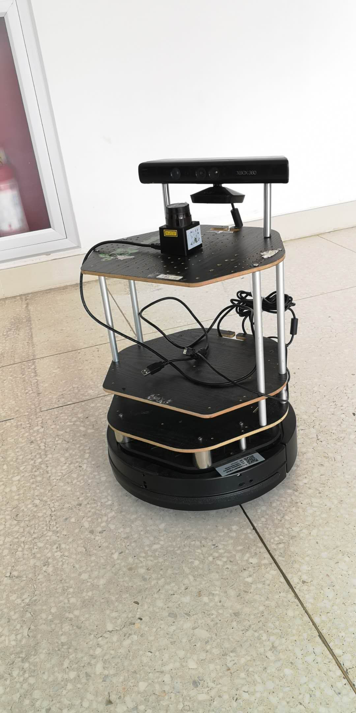

#  摘要

​	本文主要介绍了如何实现一个能够完成接送客人的机器人，按照顺序分别介绍了我们设计的总体框架，我们设计的机器人功能平台，然后给出了我们对于服务机器人开发上软件的贡献，以及对于完成这个任务所实现的软件上的贡献。其中我们主要实现了基于有限状态机的回环状态控制系统、基于优化EKF算法的slam建图方案、基于视觉控制的盲导航系统以及基于科大讯飞API的语音识别系统等。其中我们在导航方面还设计出了自动化实时位姿输出器、自动化位姿定位器、以及有图导航与盲导航平滑切换的解决方案，在语音方面我们设计出了语音识别智能控制开启与关闭的解决方案。最后我们对我们的研究进行了总结与探讨了进一步可以改进与研究的方向。在实际测试视频中我们实际测试的视频，我们给出对应测试时控制电脑的数据输出和`rviz`结果显示。

[TOC]


# 简介

​	我们主要选择完成fare_well的任务，其主要目的如下：

​	任务要求机器人能够自主的将顾客送到其对应的车子（司机）然后回收雨伞，其中还包括将自动取人的衣服然后送还给顾客。

​	为了实现这个任务，我们将任务分解为4个子任务，最后进行任务松耦合化处理。最终将所有任务分成如下阶段：

1. 等待启动与识别顾客阶段
2. 取物阶段与传递物品阶段
3. 引导出门与寻找司机阶段
4. 回收雨伞与导航回归阶段

然后我们将任务过程进一步拆分，下面按阶段给出对应的主要技术：

第一阶段：视觉识别与语音交流。

第二阶段：自主导航、机械臂抓取、视觉识别。

第三阶段：自主导航、盲导航、机械臂人机结合、视觉识别、语音识别。

第四阶段：机械臂抓取、自主导航、语音识别。

​	最终我们通过硬件框架设计与软件控制系统设计结合多种创新算法最终在$turtlebot2$上完成了对应的任务。下面我们将按硬件设计、软件贡献和总结的顺序给出我们对于fare_well这个问题的解决方案与创新。

# 设计框架

## 机器人系统设计框架

<div align=center>
    	
</div>


## 节点关系框架

<div align=center>
    	
</div>

​	从图中我们可以看到，导航核心节点就是move_base，我们利用我们自主设计的set_goal以及control_core等节点完成了语音与导航的结合，最后实现了任务的全部过程。

## 任务实现框架


# 机器人硬件平台

## Hokuyo

​	为了建图更准确与导航更精准，我们选择利用激光雷达导航与slam的方式，通过设计我们添加了如下的激光雷达驱动，最后结合gmapping算法成功完成了建图相关流程。其主要结构如下所示：

<div align=center>
		    
</div>

## Kinect

​	由于任务中需要我们通过视觉算法去识别人的信息，所以我们采用了kinect作为我们的视觉传感器。

​	其主要结构如下图所示:

<div align=center>
		    
</div>

## Turtlebot 

最后我们给出我们机器人的相关参数，与实际的模型如下(这里应该有机器人的照片)


<div align=center>
		    
</div>

​	

# 机器人软件贡献

### 有限状态机控制

​	我们主要通过设计一套可以自启动的有限状态机。整个有限状态机的流程如下：


​	从上图我们可以看出，我们采用了回环控制。在任务的开始和结束保证机器人的状态一致，其中包括位姿一致与算法状态一致。也就是在每一次执行任务之前保证机器人都处在同一个状态（也就是开启有图导航和语音伺服的状态)

​	其控制部分的主要代码在`set_goal.cpp`中，其核心代码见附录：**(这个可以转换为节点关系图)**

​		

​	上图中我们可以看出，我们主要采用了语音信号控制结合状态信号控制双向控制的方式，保证在不需要语音的时刻能阻塞语音节点，提高控制系统的鲁棒性。


## 导航与slam建图

### slam建图

#### $ekf\_slam$算法原理性分析

##### $ekf$原理

​	移动机器人的自定位过程是一个非线性化的过程，从统计的角度看， SLAM 问题是一个滤波问题，在系统噪声和测量噪声服从正态分布的情况下EKF 可以很好地去除系统中的噪声干扰实现最优估计，因此Smith和Cheeseman 提出使用EKF 来估计SLAM 问题的EKF － SLAM算法，该算法流程框图如图1。

​	

​                                                         图1 EKF － SLAM 算法流程

​	扩展卡尔曼滤波算法是一种常用的非线性滤波方法，其原理是在预测点$x_{k|k-1}$将系统状态方程和测量方程进行泰勒展开，并忽略所有非线性展开高阶项来实现对非线性方程的线性化近似回。常用的非线性离散随机系统模型如下：
$$
\begin{array}{l}{x_{k+1}=f\left(x_{k}, u_{k}\right)+w(t)} \\ {z_{k}=h\left(x_{k}\right)+v(t)}\end{array}
$$
​	其中w，v代表了附加在非线性系统运行过程中的0均值高斯噪声。将系统方程进行线性化表示为：
$$
\begin{array}{l}{x_{k} \approx \hat{x}_{k}+J\left(x_{k-1}-\hat{x}_{k-1}\right)+W \omega_{k-1}} \\ {z_{k} \approx \hat{z}_{k}+H\left(x_{k}-\hat{x}_{k}\right)+V v_{k}}\end{array}
$$
式中$J=J(k)=\left.\frac{\partial f}{\partial x}\right|_{\left(x_{k}, u_{k}\right)}, H=H(k)=\left.\frac{\partial h}{\partial x}\right|_{x=x_{k}},W=W(k)=\left.\frac{\partial f}{\partial \omega}\right|_{\left(x_{k}, u_{k}\right)}, V=V(k)=\left.\frac{\partial h}{\partial v}\right|_{x=x_{k}}, \hat{z}_{k}$

表示观测值，$\hat{x}_{k}$表示预测值。初始时刻滤波器设置为：
$$
\hat{x}_{0}=E\left(x_{0}\right), P_{0}=E \quad\left[x_{0}-\hat{x}_{0}\right)\left(x_{0}-\hat{x}_{0}\right)^{\mathrm{T}} ]
$$
通过下面前三个式子迭代运算可进行预测更新，通过下面后四个式子迭代运算可进行状态更新。
$$
\begin{array}{l}{x_{k+1 | k}=f\left(x_{k | k}, u_{k}\right)} \\ {P_{k+1 | k}=J P_{k | k} J^{\mathrm{T}}+Q_{k}} \\ {S_{k+1}=H_{k+1} P_{k+1 | k} H_{k+1}^{\mathrm{T}}+R_{k+1}} \\ {W_{k+1}=P_{k+1 | k} H_{k+1}^{\mathrm{T}} S_{k+1}^{-1}} \\ {\vartheta_{k+1}=z_{k+1}-h\left(x_{k+1 | k}\right)} \\ {x_{k+1 | k+1}=P_{k+1 | k}-W_{k+1} S_{k+1}} \\ {P_{k+1 | k+1}=P_{k+1 | k}-W_{k+1} S_{k+1} W_{k+1}^{\mathrm{T}}}\end{array}
$$

##### $ekf-slam$算法

​	基于EKF的SLAM算法包含运动更新和观测更新两个过程，这两个过程分别是对系统的运动模型和观测模型的描述。运动更新过程是用各传感器数据作为输入控制量，对机器人当前位置进行预测估计。观测更新是当移动机器人观测到当前环境中的特征点并与局部地图匹配，同时更新机器人在地图中的位置的过程。通常机器人SLAM将位姿信息$x_v$,和地图特征$m_i(x_i,y_i)$存储在一个独立的状态向量$x_{ml}$中：
$$
x_{m l}(k)=\left[ \begin{array}{c}{x_{v}(k)} \\ {m^{i}(k)}\end{array}\right]
$$
​	其中$x_v(k)$表示k时刻下移动机器人的位姿,$m_n^i(k)$表示k时刻下的n个地图点特征集。系统的特征与位姿之间的协方差矩阵为：
$$
P_{m l}(k)=\left[ \begin{array}{cc}{p_{t v}(k)} & {p_{r m}(k)} \\ {p_{m v}(k)} & {p_{m m}(k)}\end{array}\right]
$$
​	整个地图信息为$M^{B}=\left(x_{m l}, P_{m l}\right)$

​	在EKF算法式(4)对机器人状态的预测中，包括了地图特征位置的预测$\hat{z}$,而移动机器人通过外部传感器的观测值$z$进行数据关联匹配，移动机器人通过$z$与$\hat{z}$的匹配信息进行自定位，更新地图。

​	最后我们结合gmapping算法实现了地图的完整构建(这个地方应该有构建的地图)

##### 算法应用效果对比分析

​	下面是我们不加入ekf直接用gmapping算法构建的地图


​	可以看出其效果较差，下面是我们加入EKF滤波之后结合gmapping实现的同一环境下建图效果:

​	

​	从上图我们可以发现加入EKF算法之后的slam建图效果得到了明显改善，基本上能实现回环建图,最后能建图能封闭。

### 导航

#### 自动化实时位姿输出器

​	在我们设计的流程中多次用到位姿锁存技术，也就是将某一时刻的位姿保存起来便于未来在同一个全局坐标系下恢复原来的位姿状态，从而实现完全状态复原。其主要代码如下，全部函数实现可见附录二：

```c++
transformStamped = tfBuffer.lookupTransform("map", "base_link",
                               ros::Time(0));
```

​	其中主要就是利用了map坐标系和base_link坐标系的转换数据，通过实施发送对应的坐标系变换数据，从而获取机器人任何时候的实时位姿信息。

#### 自动化定位器

​	在位姿锁存的基础上，我们希望在没有人操作的情况下能够实现rviz的位姿定位功能，便于我们在确定机器人的位姿的情况下自动化的进行rviz的位姿矫正。

​	其主要与amcl的消息传递图如下：


​	其中主要通过发布名为`"initialpose"`的话题信息，通过原来锁存的位姿信息恢复机器人的位姿状态，最终可以提高amcl导航定位的成功率。

#### 盲导航技术

​	初始的gmapping结合move_base的导航中无法到达位置区域。**（这里应该有图证明原来规划总是失败的）**

所以通过修改move_base相关的参数接口，结合视觉识别的坐标输入，最终我们实现了，在地图未知的情况下的导航功能。（这里应该有图，也就是实现了未知情况下的导航，也就是rviz中的截图）期主要修改如下

```yaml
allow_unknown: true                      
```

#### 有图导航与无图导航切换技术

##### move_base 导航框架

​	move_base的主要框架如下：


​	在ros的导航中，一般我们采用键盘控制结合gmapping进行slam与建图，通过map_server存储我们建立的地图，然后开启amcl利用已经构建完成的地图进行进一步的导航。我们希望导航的时候能够实时的更新地图，而且保留原有的地图不受破坏，便于二次使用。但是如果我们直接开启gmapping，更新的地图会将原来的地图清空，从而无法实现原地图保留的功能。所以我们设计了利用amcl与map_server的有图导航和利用gmapping和move_base的无图导航，同时构建起两个状态之间转换的桥梁,实现有图导航和无图导航的平滑切换，最终可以实现fare_well所要求的二次伺服的效果。

##### 有图导航节点消息图

<div align=center>
    
</div>

##### 动态状态切换

​	为了实现如下流程:


​	完成状态切换，我们设计了动态状态切换算法具体实现方法如下:

​	首先我们设计空节点，便于动态关闭对应的状态，开启另一状态。

```c++
system("rosnode kill /empty_node ");
```

这样我们就可以完成gmapping状态的关闭

然后通过与系统直接交互，实现动态状态切换:

```c++
system("gnome-terminal -x bash -c 'roslaunch fare_well gmapping_demo.launch' ");
```

##### 切换前RVIZ状态


##### 切换后RVIZ状态


## 	语音

### 科大讯飞语音控制

​	我们主要采用了科大讯飞的语音识别系统。其中我们通过语音接收，字符串过滤，命令识别到语音阻塞等一系列流程完成语音的控制。

​	在科大讯飞API的基础上，我们设计出ROS的接口，设计对应的语音识别与语音识别唤醒操作。其主要实现可见附录三。其主要的节点关系图如下：

<div align=center>
    	
</div>


而/sound_node又可以将识别到的信息发送给我们的核心节点。

### 语音阻塞

​	为了减少计算机在语音控制时的计算压力，提高机器人系统的实时性与避免错误语音控制和噪声对于控制系统的干扰，我们通过改编科大讯飞语音API实现了语音识别的自动化开启与关闭,其控制关系如下：


​	从上图我们可以看出我们通过/open_voice节点控制/sound_node（科大讯飞API修改后的节点）开启与关闭语音识别。其主要实现方式如下

```c++
system("gnome-terminal -x bash -c 'rosrun test open_voice' ");
system("rosnode kill /wake_up ");
```

​	通过上面两个函数我们就可以实现任何状态下自如的开启与关闭对应的语音识别节点。

### 语音滤波

​	由于科大讯飞识别后的字符串格式不规范，难以处理，而且经常会识别出中文字符，容易导致节点关闭，所以我们加入了字符串滤波算法，其主要实现如下：

```c++
void clear_str(string & datastr)
{
    for(int i=0;i<datastr.length();i++)
    {
         if(datastr[i]>='a'&&datastr[i]<='z'||datastr[i]>='A'&&datastr[i]<='Z')
         {
             if(datastr[i]>='A'&&datastr[i]<='Z')
             {
                 datastr[i] = datastr[i] - 'A' + 'a';//小写化
             }
             continue;
         }
         else 
         {
             datastr.erase(i,1);
         }
    }
}
bool is_equal(string a,string b)
{
    clear_str(a);
    clear_str(b);
    // cout<<a<<endl<<a.length()<<endl;
    // cout<<b<<endl<<b.length()<<endl;
    if(a.length()!=b.length())
    return false;
    for(int i=0;i<a.length();i++)
    {
        if(a[i]!=b[i])
        return false;
        
    }
    return true;
}
```

​	通过相关测试，无论在有杂音、噪声、中文字符的语音识别输入下，我们的算法均可以识别出对应的控制信号，从而准确的发起控制命令。(这里可以给出没有滤波之前的效果和滤波之后的效果)

# 总结与展望

​	我们主要通过设计一套完整的闭环控制系统来完成farewell的全部任务，其中提出了多传感器融合、结合深度学习视觉定位的盲导航，以及结合科大讯飞的智能语音控制器和语音应答等功能。在机器人的软件开发上，我们首次采用双重控制的算法执行框架以及实现了以导航为中心的多接口多任务执行系统。

​	我们希望进一步能通过结合RRT算法对于盲导航的路径规划进行优化。

# 附录

## 附录一`set_goal.cpp`——核心代码

```cpp
void fare_well::cmd_cb(const std_msgs::String::ConstPtr &msg)
{
    cmd_str = msg->data.c_str();
    if( work_begin && is_equal(cmd_str,"robot finish recognize the people")||is_equal(cmd_str,"robot  finish first task"))//大小写问题也要注意
    {
        robot_go_to_the_shelf = true;
        
        order_command("stop listen");
        tell_the_task("plase wait a minute , and i will take back your coat!");
        ROS_INFO("plase wait a minute , and i will take back your coat! ");
        get_present_pos(this->last_pos);
        go_to_the_shelf();
        robot_go_to_the_shelf = false;
        cmd_str = "";
        return ;
    }
    if( work_begin && is_equal(cmd_str,"robot  get the coat")||is_equal(cmd_str,"robot finish second task"))
    {
        robot_go_back_to_the_call_place = true;

        order_command("stop listen");
        
        tell_the_task("ready to go back to the calling place!");
        ROS_INFO("ready to go back to the calling place!");
        go_to_place(this->last_pos);
        robot_go_back_to_the_call_place = false;
        tell_the_task("here is you coat");
        sleep(1);
        tell_the_task("are you ready to go out?");//等人穿衣服
        
        order_command("start listen");
        cmd_str = "";
        return ;
    }
    if( work_begin && is_equal(cmd_str,"robot ready to go to the door"))
    {
        robot_go_out_the_door = true;
        order_command("stop listen");
        
        tell_the_task("let's go out , i will take you to your cab");
        ROS_INFO("let's go out , i will take you to your cab ");
        go_to_the_door();
        out_door_pose.pose.pose = cur_pose;
        robot_go_out_the_door =false;
        cmd_str = "";
        order_command("close amcl");    
        sleep(3);                        
        order_command("start gmapping");
        sleep(3);
        return ;
    }
    if(work_begin && is_equal(cmd_str,"find the cab pose"))
    {
        robot_go_to_the_cab = true;
        get_present_pos(this->last_pos);
        tell_the_task("this way please!");
        ROS_INFO("this way please!");
        sleep(5);
        go_to_the_driver();
        order_command("robot arrive the cab");
        cmd_str = "";
        robot_go_to_the_cab =false;
    }
    if( work_begin && is_equal(cmd_str,"robot arrive the cab"))
    {
        
        tell_the_task("thank you for your coming!");
        ROS_INFO("thank you for your coming!");
        tell_the_task("can you give me the umbrella?");
        sleep(5);
        order_command("start listen");
        cmd_str = "";
    }
    if( work_begin && is_equal(cmd_str,"robot get the umbrella")||is_equal(cmd_str,"robot  finish last task"))
    {
        order_command("stop listen");
        robot_go_back_to_the_door = true;
        tell_the_task("get back the door!");
        ROS_INFO("get back the door!");
        go_to_place(this->last_pos);
        robot_go_back_to_the_door =false;
        order_command("close gmapping");
        sleep(5);
        order_command("start amcl");
        for(int i=1;i<=10;i++)
       { pub_est_pose.publish(out_door_pose);
         sleep(1);
       }
       order_command("go back to serve");
        cmd_str ="";
    }
    if (work_begin && is_equal(cmd_str, "go back to serve"))
    { 
        sleep(5);
        pub_est_pose.publish(out_door_pose);
         robot_go_back_to_the_serving_place = true;
        

        go_to_serve_place();
        order_command("start listen");
        robot_go_back_to_the_serving_place = false;
       
        work_begin = false;
        work_done = true;
       
        
        cmd_str = "";
        }

}
void fare_well::cb(const std_msgs::String::ConstPtr & msg )
    {
        
      std::string voice_command;
       
       voice_command = msg->data.c_str();
       cout<<voice_command<<endl;
  
       if(is_equal(voice_command,"i want to go")||is_equal(voice_command,"take me out"))
       {
           order_command("stop listen");
           tell_the_task("task confirmed!");
          
           tell_the_task("start recognizing");
           ROS_INFO("start recognizing");
           
           work_begin = true;
           work_done = false;
       }
      
       if(work_begin && is_equal(voice_command,"we can go out")||is_equal(voice_command,"go out"))
       {
           order_command("stop listen");
           order_command("robot ready to go to the door");//硬控
       }
       
       if(work_begin && is_equal(voice_command,"you can go back")||is_equal(voice_command,"go back"))
       {
           order_command("robot  finish last task");
       }

    }
```

## 附录二实时位姿输出器实现源码

```c++
void get_present_pos(geometry_msgs::Pose & pre_pos )
{
    tf2_ros::Buffer tfBuffer;
    tf2_ros::TransformListener tfListener(tfBuffer);
    int flag=0;
    while(ros::ok()&&flag==0)
    {
    geometry_msgs::TransformStamped transformStamped;
     try{
        transformStamped = tfBuffer.lookupTransform("map", "base_link",
                               ros::Time(0));
        pre_pos.position.x = transformStamped.transform.translation.x;
        pre_pos.position.y = transformStamped.transform.translation.y;
        pre_pos.position.z = transformStamped.transform.translation.z;
        pre_pos.orientation.x = transformStamped.transform.rotation.x;
        pre_pos.orientation.y = transformStamped.transform.rotation.y;
        pre_pos.orientation.z = transformStamped.transform.rotation.z;
        pre_pos.orientation.w = transformStamped.transform.rotation.w;
        flag=1;
        }
    catch (tf2::TransformException &ex) {
      ROS_WARN("%s",ex.what());
      ros::Duration(1.0).sleep();
      continue;
    }
    }
}
```

## 附录三科大讯飞API在ROS上的应用

````c++
void on_speech_begin()
{
    if (g_result)
    {
        free(g_result);
    }
    g_result = (char*)malloc(BUFFER_SIZE);
    g_buffersize = BUFFER_SIZE;
    memset(g_result, 0, g_buffersize);

    printf("Start Listening...\n");
}
void on_speech_end(int reason)
{
    if (reason == END_REASON_VAD_DETECT)
        printf("\nSpeaking done \n");
    else
        printf("\nRecognizer error %d\n", reason);
}

void WakeUp(const std_msgs::String::ConstPtr& msg)
{
    printf("waking up\r\n");
    usleep(700*1000);
    wakeupFlag=1;
}

    ros::Subscriber wakeUpSub = n.subscribe("voiceWakeup", 1000, WakeUp);   
   
    ros::Publisher voiceWordsPub = n.advertise<std_msgs::String>("voiceWords", 1000);  
    ROS_INFO("Sleeping...");
    int count=0;
    while(ros::ok())
    {
        // 语音识别唤醒
        if (wakeupFlag){
            ROS_INFO("Wakeup...");
            int ret = MSP_SUCCESS;
            const char* login_params = "appid = 5c9ee709, work_dir = .";

            const char* session_begin_params =
                "sub = iat, domain = iat, language = zh_cn, "
                "accent = mandarin, sample_rate = 16000, "
                "result_type = plain, result_encoding = utf8";

            ret = MSPLogin(NULL, NULL, login_params);
            if(MSP_SUCCESS != ret){
                MSPLogout();
                printf("MSPLogin failed , Error code %d.\n",ret);
            }

            printf("Demo recognizing the speech from microphone\n");
            printf("Speak in 10 seconds\n");

            demo_mic(session_begin_params);

            printf("10 sec passed\n");
        
            wakeupFlag=0;
            MSPLogout();
        }

        // 语音识别完成
        if(resultFlag){
            resultFlag=0;
            std_msgs::String msg;
            msg.data = g_result;
            voiceWordsPub.publish(msg);
        }

        ros::spinOnce();
        loop_rate.sleep();
        count++;
    }

````

## 附录四实际测试视频

### 一次伺服视频


<video src="一次测试.mp4"></video>

### 循环伺服视频

<video src="二次测试.mp4"></video>

## 附录五实际测试流程视频

### 主机运行情况

<video src="一次测试时主机运行情况测试.mp4"></video>

### 从机运行情况

<video src="一次测试时从机运行情况测试.mp4"></video>